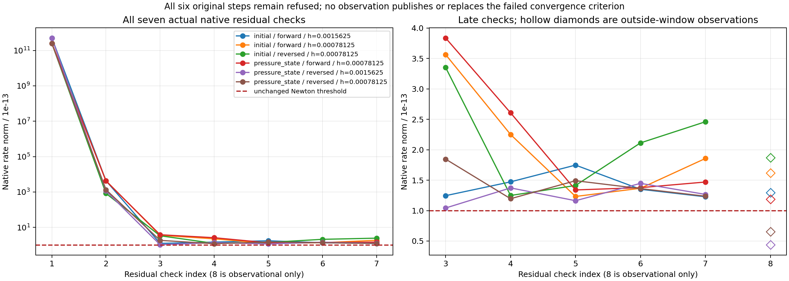

# Exact diagnosis of the six finer native refusals

The six original finer refusals remain `IterationLimit`; the original geometry
convergence band and failed five-interval qualification remain unchanged. This
diagnostic milestone adds no production repair or accepted final-time endpoint.
It distinguishes the exact stopping site from a proof of an arithmetic floor
or a general convergence rate.

The tested ordinary-main integration is commit
`f76841e9217e781d91c5bfeabadb6b4c6f42b20b`, with qualified source
`8a19cc209436e052422e8f72fbb982a92dddf484`. Its full Rust matrix passed
246/240/252 tests plus all three Clippy configurations. Actual local commands
took 2372.84 seconds in the cold dedicated target; this does not qualify the
current hosted 30-minute CI budget. The main/column repair is separate.

## Actual stopping condition

The native loop permits seven residual checks. Check 1 evaluates the seed.
Every failed check evaluates six numerical derivative columns, assembles the
linear pressure columns, solves one correction and updates the unknown. The
seventh correction is computed, but its resulting candidate is **not checked
inside that window**. If none of the seven checks has norm at most `1e-13`,
the loop returns `IterationLimit` before the physical acceptance and third
component stages.

All six measured failures take this path. Each has seven above-threshold
checks and 49 counted equation evaluations, below the unchanged 200-call
budget. None of these errors is an arithmetic, subnormal, linear-solve,
time-resolution, work or post-solve qualification error. This identifies the
actual refusal site; it does not establish why all possible future iterates
would or would not converge.

| Fixture / load | h | Attempted step | Minimum original checked norm | Seventh checked norm | Unused seventh-correction norm, order 16 |
| --- | --- | --- | --- | --- | --- |
| initial / forward | 0.0015625 | 1 | 1.227193e-13 | 1.227193e-13 | 1.293569e-13 |
| initial / forward | 0.00078125 | 1 | 1.232194e-13 | 1.857097e-13 | 1.618515e-13 |
| initial / reversed | 0.00078125 | 1 | 1.248709e-13 | 2.460155e-13 | 1.869595e-13 |
| pressure state / forward | 0.00078125 | 2 | 1.339533e-13 | 1.469922e-13 | 1.189544e-13 |
| pressure state / reversed | 0.0015625 | 7 | 1.042937e-13 | 1.266263e-13 | 4.390146e-14 |
| pressure state / reversed | 0.00078125 | 1 | 1.195531e-13 | 1.236495e-13 | 6.552095e-14 |

The first two checks reduce the residual by many orders of magnitude; late
checks oscillate close to the original target. Candidate masses are bit-identical
through all recorded late transitions, while candidate velocity bits continue
to change. Geometry coordinates are often, but not universally, bit-identical.
These observations do **not** prove an unattainable floating-point floor.

In the two reversed-pressure cases, the unused seventh correction meets the
Newton threshold when separately observed. Order-32 observations give
`4.390699e-14` and `6.551177e-14`. No original check, full work/GCL/constraint
qualification, third-component solve, publication, common final-time endpoint
or temporal criterion is replaced by these observations. The other four unused
candidates remain above the same threshold. No solver limit or tolerance is
relaxed and no new acceptance path is implemented.

## Source and accepted-state controls

The separate diagnostic branch adds only explicitly marked blocks guarded by
`cfg(rheon_newton_trace)` in the solver and the existing bounded probe. Removing
those blocks restores both original source files **byte for byte**. A marked
Cargo lint entry declares this one cfg name, preserving ordinary builds without
requiring diagnostic flags; removing that entry restores the original manifest.
Cargo features, numerical constants, arithmetic helpers, norm comparisons, loop bounds,
linear solves and publication code retain their original lines. The custom cfg
is recognized through `--check-cfg`; Clippy remains at `-D warnings`.

The trace uses existing candidate workspaces and fixed arrays. Output streams
are bounded by eight cases, at most 128 steps per case, seven original checks
per attempt, two observational equation evaluations per refusal and exactly
one retry for each refusal. It adds no accepted owner, rollback copy or growing
native history. The accepted owner's reported allocation remains 474768 bytes.

Default/no-default builds with tracing disabled and enabled all reproduce the
original 143 publications and eight terminal markers byte for byte: 135 accepted
steps, two completed cases and six refused cases. Trace streams also agree byte
for byte across those modes. Six same-owner retries reproduce every original
check, correction and observation exactly and refuse again.

Release assertions compare accepted velocity, pressure coefficients, clock,
stamp, node positions, masses, triangle topology and periodic IDs bit for bit
before/after every original refusal and retry. This explicitly describes the
snapshot coverage; it does not assert equality of every workspace scratch or
derived operator buffer. No accepted field is replaced by an observed candidate.

## Independent arithmetic comparison and remaining limits

`analyze.py` audits all 1227 native trace events, all 135 accepted Newton paths,
42 original failed checks and twelve observations. It recomputes the native
sequential norm and every recorded correction exactly from their components,
checks accepted inputs against the actual publication stream, and rejects eight
actual corruption controls in normal and optimized Python. Their outputs agree.

The independent frozen equation evaluator also evaluates those 54 captured
candidates without advancing an owner. Maximum native/independent component
differences are `2.071242483081548e-13` for the stable rate and
`2.220635889847872e-13` for the direct rate: within the existing `1e-11`
full-momentum comparison scale, but of the same order as the stricter native
Newton target. An independently rounded norm cannot replace an actual native
check. Maximum observed native order-16/order-32 rate-vector difference on the
unused candidates is `4.269046054161674e-17`; this alone is not a universal
quadrature error bound. Independent normal/optimized outputs agree.

This establishes the exact six refusal decisions and their deterministic
accepted-state preservation. A production change to stopping semantics or
arithmetic, acceptance of any unused candidate, arbitrary-fine-step solvability
and general convergence order remain unimplemented and unproved. The earlier
component-cancellation diagnosis is retained as measured refinement-regime
evidence. Research equations and Lean claims do not change; all previous
Jacobi, numerical, geometry, material, surface and proof limitations remain.
