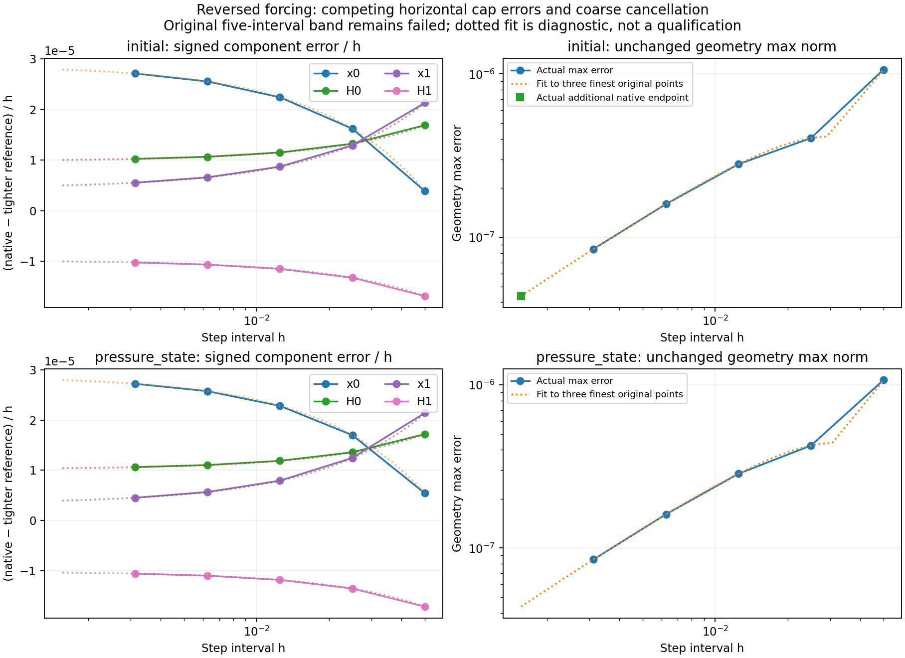

# Diagnosis of the original forcing geometry refinement failure

The unchanged original five-interval qualification remains
`FAIL_ORIGINAL_TEMPORAL_BAND`. The new experiment supports a pre-asymptotic
component cancellation and a change of the component attaining the maximum
geometry error in the declared finite discretization. It does not qualify the
original failed interval set. No production kernel, force convention, acceptance
gate, or Lean theorem changes in this milestone.

This corrects a **coordinate-label error in earlier frozen prose**:
`native-forced-extruded-liquid.md` and `frozen-forcing-experiment.md` described the
coarse dominant coordinate as a cap height. The actual `q_to_x` order is
`[cap x0, cap H0, cap x1, cap H1]`. Index 2 is the middle cap's horizontal
position, and index 0 is the periodic representative's horizontal position.
Their source and evidence bytes remain frozen. This is a correction to the
interpretation, not a change to the coordinates or numerical implementation.

## What was distinguished

The experiment starts from frozen forcing validation commit
`f0e2d3d722fa9cdbc7467c996a1b942a2bddca77`. It uses the same two initial fixtures,
two load signs, original five intervals, final time 0.1, old-mass body quadrature,
endpoint viscous and pressure terms, and trapezoidal geometry reconstruction.
In reduced coordinates the latter is
`q1 = q0 + h eta0[:3] + h^2 alpha[:3]/2`, with
`eta1 = eta0 + h alpha` (three geometry coordinates, six reduced velocities).
The full coupled temporal rule remains first order. The equations and the
previous proof limitations are unchanged: no theorem establishes its temporal
order, floating-point convergence, or arbitrary-small-step solvability.

An independent recursive solution of the same planar finite equations completed
all 20 fixture/sign/interval trajectories and 248 steps. It retained Newton rate
`1e-13`, seven iterations, 200 calls, full/direct momentum rate `1e-11`, work/GCL
`128 epsilon`, and the 16/32 quadrature gate `1e-15`. Its maximum disagreement
with the actual native accepted geometry was `2.220446049250313e-16`; the maximum
reduced-velocity disagreement was `2.886579864025407e-15`. Its maximum momentum
rate was `9.983239011633177e-14`. Thus the original error pattern is reproduced
by independently evaluating the declared finite equations; these data do not
identify a native implementation discrepancy.

Four tighter DOP853 integrations (`rtol=1e-13`, maximum step `0.0015625`) and
twelve fixed RK4 integrations (steps `0.00625, 0.003125, 0.0015625`) independently
check the instantaneous reference. RK4 uses the instantaneous equations but not
the SciPy integration algorithm. Maximum finest RK4/tight-DOP853 geometry gap is
`1.9987067556570537e-12`; maximum final RK4 refinement gap is
`8.357786684953794e-12`. Each case meets the **existing** geometry reference
resolution requirement: uncertainty at most one thousandth of its smallest
original native geometry error. The failed original ratios persist with the
tighter references. All 268 pairs of actual original constant/nonconstant-third
publications have identical planar geometry, velocity, pressure and mass.

## The measured refinement regime

The unchanged max-error ratio band is strictly `1.7 < ratio < 2.3`.

| Reversed fixture | Original consecutive ratios | Dominant coordinates at the five original intervals |
| --- | --- | --- |
| initial | 2.628753, 1.445189, 1.755377, 1.884502 | x1, x0, x0, x0, x0 |
| pressure state | 2.521001, 1.488677, 1.772215, 1.892017 | x1, x0, x0, x0, x0 |

A descriptive signed component expansion `e(h)=c1*h+c2*h^2+c3*h^3`, fitted
only at the three finest **original** intervals, has opposing x0 coefficients:

| Reversed fixture | x0 c1 | x0 c2 | Magnitude of second/first term at h=0.05 | Maximum error predicting withheld coarse vectors |
| --- | --- | --- | --- | --- |
| initial | 2.868451690063445e-5 | -5.021840051355753e-4 | 0.875357 | 4.2165937408229003e-10 |
| pressure state | 2.871744435658148e-5 | -4.717534032749872e-4 | 0.821371 | 4.819162735537567e-9 |

The fit is checked against the two withheld coarse error vectors. It explains
why a single maximum-norm ratio can jump above then below the expected band as
the horizontal components cancel and exchange dominance. It is a measured
description, not an asymptotic-order proof, extrapolated endpoint, or substitute
for a passed qualification. Both forward controls retain the original band.

The plot source is `evidence/forcing-temporal-diagnosis/plot.py`; the exported
PNG/PDF use actual accepted endpoints and independent references. Dotted fit
segments are explicitly distinguished from measured points. No refused case
supplies a fabricated final-time endpoint.

## Actual finer native probes and their limits

The new `forcing_temporal_probe` example uses the existing public owner,
workspace and force step with its unchanged 474768-byte owner budget. A bounded
stack snapshot checks every public accepted field bit for bit on refusal; it
adds no production owner or growing history. Default and no-default release
exports are byte-identical. The actual capture contains eight constructors,
135 accepted steps, two completed cases and six `IterationLimit` refusals.

| Fixture/sign | h=0.0015625 | h=0.00078125 |
| --- | --- | --- |
| initial / forward | refusal at step 1; 0 accepted | refusal at step 1; 0 accepted |
| initial / reversed | completed 64 steps | refusal at step 1; 0 accepted |
| pressure state / forward | completed 64 steps | refusal at step 2; 1 accepted |
| pressure state / reversed | refusal at step 7; 6 accepted | refusal at step 1; 0 accepted |

The completed reversed-initial endpoint has geometry error
`4.359415338439643e-8` and additional halving ratio `1.9438043110168854`, inside
the unchanged band. Its full momentum replay rate is
`1.2165313946260582e-13`. The completed forward-pressure endpoint has ratio
`2.010471945398751`. These are additional actual observations; they do not erase
either original failed ratio or the other six native refusals. The error API
does not expose the refused residual magnitude, so this packet does **not**
establish the cause of the finer `IterationLimit` results or claim a numerical
floor was proved. Accepted state is preserved exactly on all six refusals.

`replay_probe.py` replaces only diagnostic input grouping and step counts; it
executes the original frozen physical replay equations and gates unchanged.
Normal and optimized Python runs agree. The original 536-publication, five-H
qualifier and its negative results remain untouched. Supplemental corruption
controls exercise the probe schema, physical replay and refusal records.

## Scope retained

The new source is diagnostic only. It establishes which measured regime caused
the original interval-set failure without relaxing the band or extending model
scope. The fine refusal limit remains a separate unresolved runtime limitation.
No general surface reconstruction, arbitrary geometry, liquid-volume/free-surface
pressure coupling, general material viscosity/adhesion/density, three-dimensional
simulation, browser execution or hosted-CI qualification is added. The existing
fixed periodic extruded model and its previous numerical and Lean limitations
remain. Column reader/CI repair and its independently merged main history remain
separate from this forcing experiment.
