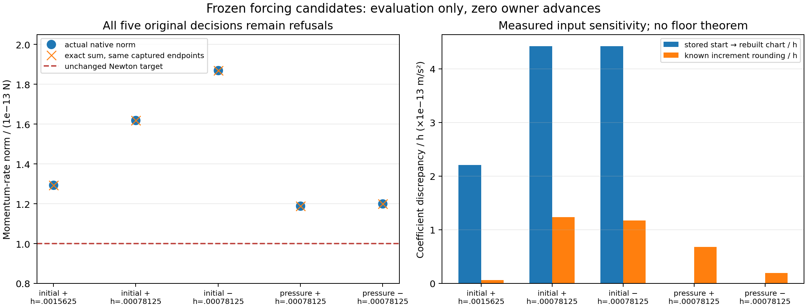

# Remaining forcing refusals: arithmetic evidence and implementation decision

Executor access was verified first and remained available. Base diagnosis is frozen `dad53b4054034fe0c2ff6240464df7441ab4e6a9` (tree `57648befc4e108bf8d727b3367adf7e119cdebc1`); forcing integration `f76841e9217e781d91c5bfeabadb6b4c6f42b20b` (tree `b9d0444dd5b661bae470b8fe6fa9fb9f547311fc`) stays clean and separate. Main was read-only fetched and verified at PR19 merge `9cd4587a54befa61bdfddc8e35014bd3c34f02fb`, tree `69def74e09a06c46a812eaadb8530a53306b9daa`. No PR19 qualification, workflow/publication change, PR or merge is performed here.

## What was actually evaluated

`make_inputs.py` binds all five remaining refused terminal candidates to frozen `trace-finer-stderr.log` and the corresponding actual accepted publications in `trace-finer.jsonl`. Both their source hashes and full inputs are retained. Nothing is inferred from a fabricated final endpoint. The native research probe invokes the original `Work::equation` on these fixed inputs without calling an owner advance. It exactly reproduces every frozen rate component and sequential norm bit-for-bit in Rust 1.92 release/core-only. It also runs the original isolated planar 16/32 qualification on these observed candidates. The third/total/publication stages are not executed and no candidate is accepted or published.

The native probe is an archived **test-only source overlay**, not a production change. `probe-overlay.patch`, `overlay-coupled-source.rs`, the exact three probe versions, generated fixed inputs, compiler/test logs and tool versions are retained. The production module was restored byte-for-byte from dad53 after capture. Cargo, src/tests/examples, original evidence, public APIs and all arithmetic gates remain unchanged. The dedicated minimal release target is `/workspace/.rheon-tools/forcing-arithmetic-target`; no frozen/shared release cache is used.

## Five actual decisions and physical checks

| Frozen candidate | h | Actual accepted input version | Native Newton norm | Exact sum of same native endpoint data | Planar work / allowance |
|---|---:|---:|---:|---:|---:|
| initial, forward | 0.0015625 | 0 | 1.293569110591616e-13 | 1.293562145744529e-13 | 0.00500503 |
| initial, forward | 0.00078125 | 0 | 1.618514956727090e-13 | 1.618523116659760e-13 | 0.00428182 |
| initial, reversed | 0.00078125 | 0 | 1.869595284647958e-13 | 1.869578174693213e-13 | 0.00387104 |
| pressure state, forward | 0.00078125 | 1 | 1.189544421792083e-13 | 1.189584287367907e-13 | 0.00075991 |
| pressure state, reversed | 0.00078125 | 1 | 1.199939254220938e-13 | 1.199948725073879e-13 | 0.00175037 |

Every original native Newton decision remains a refusal at **1e-13** after the original seven corrections/eight checks. Exact rational products and sums of the captured binary endpoint data change rate components by at most `6.511290176734766e-18`. Every resulting norm still exceeds 1e-13. Compensating the final residual sum alone is therefore not a supported fix for these five captures.

All five observed candidates pass the original isolated planar qualification, including full/direct momentum, work/energy ledger, pressure work, GCL and quadrature checks. Maximum residual-work fraction is 0.00500504, maximum energy-ledger fraction is 0.00245506, maximum recorded GCL defect is `1.2137064253187404e-16` and maximum 16/32 quadrature difference is `1.5899073117759234e-19`. These measurements show that the original stopping gate is stricter than these later planar checks; they do not authorize bypassing Newton, assert third/total work, or constitute accepted timesteps.

## State/chart precision sensitivity

For the three initial-input cases, the public stored coefficient vector differs from a fresh native t=0 constraint-chart reconstruction by at most `3.4540271877227093e-16`. Dividing by h gives `2.2105774001425341e-13` or `4.4211548002850683e-13`. The two already pressure-published inputs reconstruct bit-identically at t=0, so initial reconstruction alone cannot explain all five failures.

For every case, known-coordinate endpoint subtraction differs from the exact binary-input h*alpha increment. Maximum increment discrepancy divided by h ranges from `6.440270678149804e-15` to `1.232960126442952e-13`. The native residual uses the actual stored accepted coefficients and actual computed endpoint coefficients. Its subtraction and the earlier rounded endpoint update are separate operations; an exact final sum cannot undo their input rounding.

An 80/120-digit calculation solves the chart using the captured binary D matrix and either stored known endpoints or exact h*alpha known increments. It changes **only the inertia term** while retaining the captured force and convection values. Several resulting norms cross 1e-13, but those are deliberately labeled isolated sensitivity probes. They are NOT coherent full-equation residuals, Newton acceptance candidates or a solver repair. The pressure/strain/flux/geometry terms and published-state checks must be recomputed consistently before such a result could support an implementation change. Exact arithmetic applied to an already rounded D is also not exact geometry assembly.

A further native probe checks exactly 44 single-parameter neighboring unknowns per case: one IEEE ULP below and above each of 22 unknowns, always using the complete original equation. All 220 observed norms remain above 1e-13. Small changes of alpha need not change rounded endpoint velocity; this restricted neighborhood is not exhaustive over representable endpoints, combined parameter changes, alternative solves or future iterations. It proves neither unattainability nor an arithmetic floor.

## Concrete next step and choices

No additional production solver defect is established by this packet. The deterministic controller returns its documented failure because every authorized actual residual check fails. All new observations retain that failure and the existing accepted state. Changing only summation, projecting stored initial velocity, replacing endpoint increments with latent h*alpha, adding a residual search or overriding Newton based on later work gates would each choose new behavior beyond a demonstrated defect. None is implemented here.

The next concrete implementation investigation should be a **coherent increment-chart equation evaluator**, with the old accepted mass and all three accepted velocities borrowed from the existing owner. It must reconstruct the dependent increment, pressure/strain forces and donor fluxes under one declared arithmetic/state contract; use fixed existing workspace reservations; retain the original Newton/correction/call, checked-division/subnormal, full/direct, work/GCL/quadrature/third and publication gates; and use one of these five original failures as an unchanged public-call counterexample. A component-only replacement is specifically excluded by the captured sensitivity evidence.

The coordinator must settle which state that evaluator is intended to qualify:

1. **Keep the current stored binary endpoint contract.** Keep all five refusals and the current bounded slice until a complete evaluator/solver counterexample shows a genuine defect under that same contract. This is the conservative current behavior; no new tolerance or model is required. A higher-precision diagnostic of the complete equation is the next evidentiary step.
2. **Make a continuous/compensated chart increment authoritative internally.** This can preserve the real finite equations and all physical gates, but must explicitly define how its Newton residual relates to rounded public velocity/geometry and any proposed persistent chart data. That is a finite-arithmetic/state-contract decision, not a transparent consequence of the present probes. It needs coherent native evaluation, public-call regression, memory accounting, cancellation/retry and physical replay before source repair or integration.
3. **Project initial data into the selected chart at construction.** This explicitly changes the accepted initial state and therefore the experiment. It may address the three measured initial reconstruction gaps, but the two pressure-state gaps are zero and their refusals remain. It cannot repair or relabel the existing frozen trajectories; it would require separately named initial-condition evidence.

Option 1 remains active; option 2 is the recommended research direction if the intended behavior is advancement of these finer cases. No tolerance expansion or equation alteration is proposed merely to obtain a pass. A successful arithmetic/solver change would still not retrospectively pass the original coarse five-interval band.

## Temporal, research and proof limits

The original reversed initial/pressure-state geometry ratios remain respectively `(2.628753, 1.445189, 1.755377, 1.884502)` and `(2.521001, 1.488677, 1.772215, 1.892017)` against the unchanged strict 1.7–2.3 band. Their independently reproduced pre-asymptotic component cancellation and dominant-coordinate switch remain separate from these runtime refusals. No new complete endpoint, temporal convergence qualification or rate theorem is supplied.

Retained sources: [temporal diagnosis](../../docs/research-book/implementation/forcing-temporal-regime-diagnosis.md), [original finer refusal diagnosis](../../docs/research-book/implementation/forcing-finer-native-refusals.md), [terminal-budget clarification](../../docs/research-book/implementation/solver-terminal-validation-budget-clarification.md), [finite arithmetic chapter and existing Goldberg S18 reference](../../docs/research-book/chapters/15-floating-point.md), and [advancing-liquid contract/proof limits](../../docs/research-book/implementation/advancing-viscous-liquid-contract.md). Existing equations, Jacobi fixtures, citations and Lean exact-real limitations are unchanged. This packet establishes no general floating-point floor, arbitrary-small-step solvability, full 3D liquid/material/surface reconstruction or anatomy claim.

## Verification

Ordinary and optimized Python outputs agree. Exact sequential reconstruction checks all five native vectors; 80/120-digit sensitivity results agree after binary export. Seven controls reject altered native rates, false publication, a missing refused case, a weakened target, an invented accepted endpoint, temporal promotion and ignored work failure. The final receipt binds the frozen inputs, test-only overlay, native logs, all analysis outputs and source restoration. Reproduction of the native probe requires applying only the archived test overlay in an isolated checkout at dad53; it must never overwrite existing logs or frozen evidence.

The final scientific PNG/PDF were generated from the bound captures and visually inspected. The velocity-coefficient panel has different physical units from momentum residual and does not display a Newton threshold. Initial renders/scripts are retained separately. No altered figure supplies a new accepted state.

The first receipt attempt (`receipt.json`, SHA256 `0448aee108e495cc800fcc43712babce59d8ca032646f0b5f1a30a3c29159c04`) incorrectly hashed its in-progress producer log. Its failed verification and original receipt/producer/source are retained without rewriting. The authoritative additive receipt is `receipt-corrected.json`; run `verify_corrected_receipt.py` in ordinary and optimized Python. It binds the completed original log and failed receipt as historical artifacts. No numerical capture or original frozen evidence changed.
